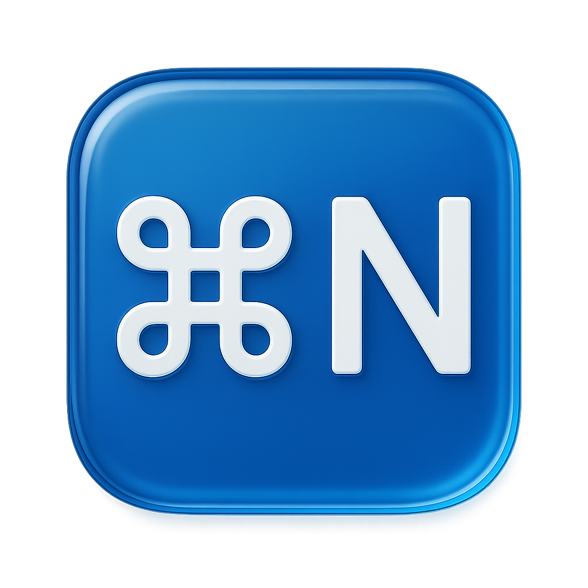
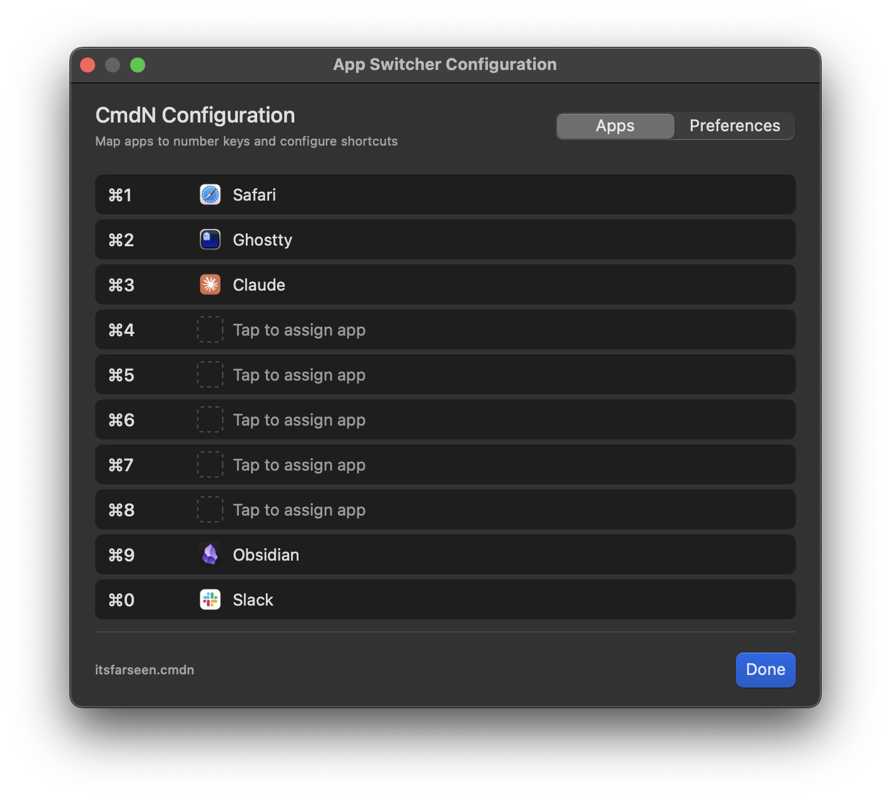
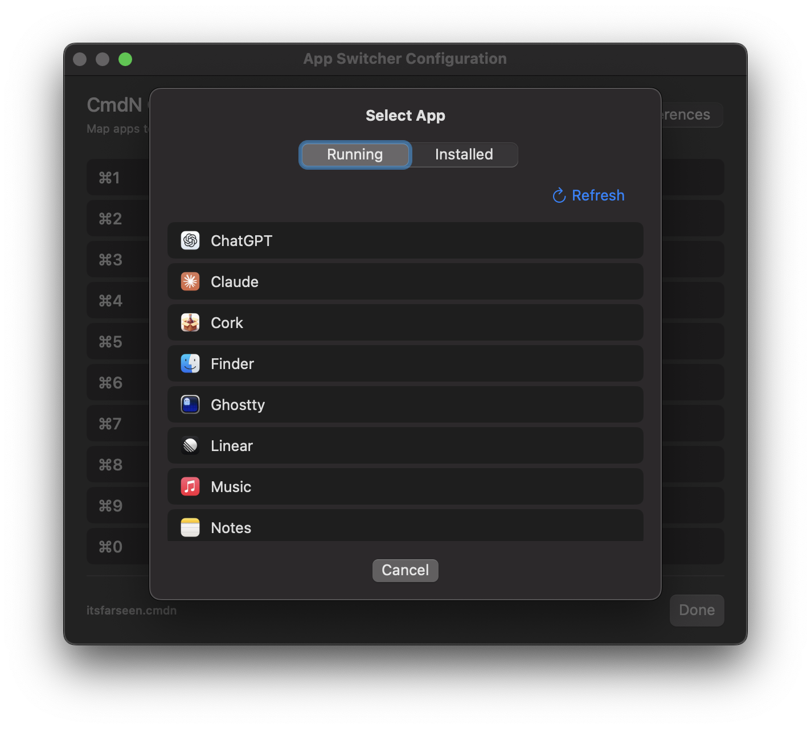
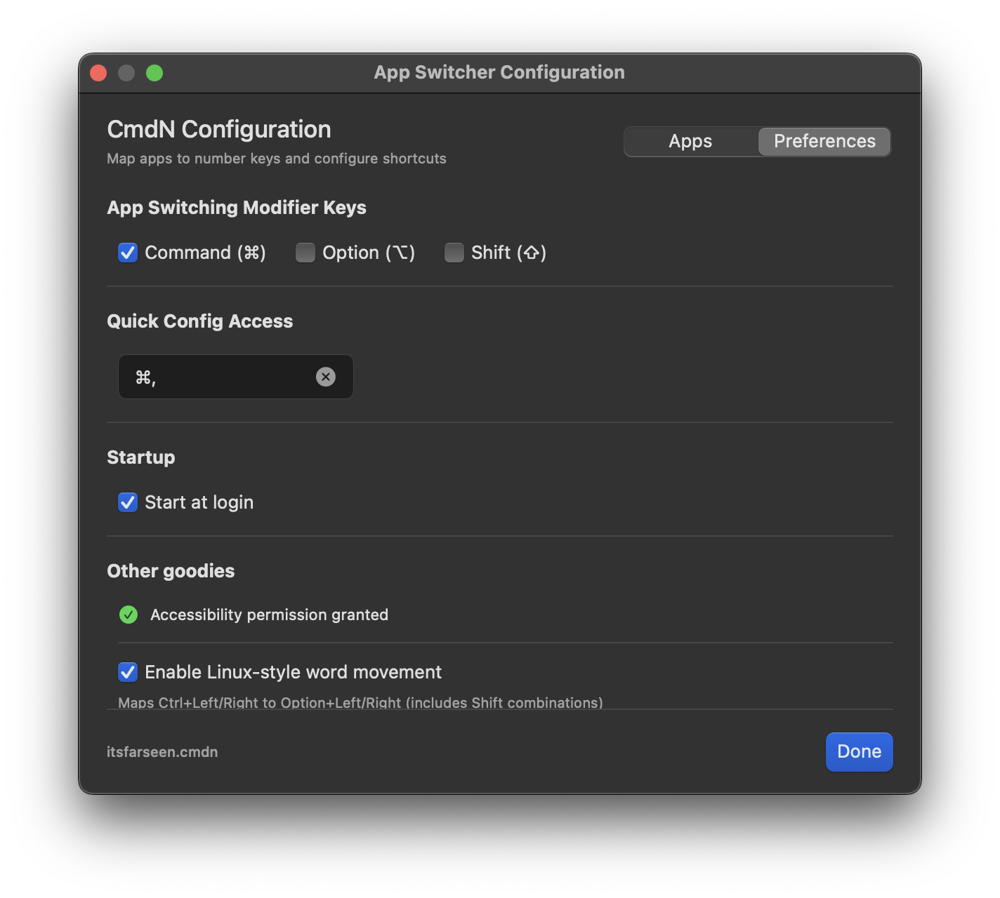

#  CmdN

**A lightweight i3-style application switcher for macOS that preserves your native workflow**

CmdN brings the simplicity and efficiency of i3-style keyboard shortcuts to macOS without compromising your native Mac experience. Switch to any application instantly with a single keystroke while keeping all your familiar Mission Control features intact.

## Why CmdN?

**Native Integration**: Unlike heavyweight alternatives, CmdN uses only standard macOS APIs and plays perfectly with Mission Control, Spaces, and three-finger swipe gestures.

**Instant Access**: Press `Cmd+<number>` to switch to any application instantly. No complex keychords or muscle memory retraining required.

**Zero Compromise**: Keep all your Mac workflows while gaining the productivity benefits of keyboard-driven application switching.

## Screenshots

### Main Configuration


### Adding Applications


### Additional Settings



## Features

### 🚀 **Lightning-Fast App Switching**
- Assign number keys (0-9) to your favorite applications
- Single-keystroke access with customizable modifiers
- Instantly bring any app to focus from anywhere

### ⚙️ **Thoughtful Configuration**
- Intuitive configuration interface
- Customizable hotkey combinations
- Dotfiles support with `~/.config/cmdn` sync
- Flexible modifier key selection

### 🖥️ **Extra Goodies**
- Workspace switching with `Cmd+[` and `Cmd+]`
- Linux-style word movement (Ctrl+Left/Right)

### 💻 **Seamless System Integration**
- Minimal menu bar presence with subtle "⌘" icon
- Runs as accessory app (no dock clutter)
- Optional system startup integration

## Comparison with Alternatives

**CmdN vs. Aerospace**
- **Mission Control Compatibility**: Aerospace forces all windows into a single desktop, breaking macOS Spaces and three-finger swipe navigation. CmdN preserves your native workflow completely.
- **Learning Curve**: Both offer fast switching, but CmdN works with your existing Mac habits rather than replacing them.

**CmdN vs. Yabai**
- **System Requirements**: Yabai requires disabling System Integrity Protection (SIP) for Mission Control features, compromising system security. CmdN uses only standard APIs with no system modifications required.
- **Complexity**: Yabai is a full tiling window manager with extensive configuration. CmdN focuses purely on fast application switching with minimal setup.

**CmdN vs. rcmd**
- **Key Ergonomics**: rcmd uses the right Command key exclusively, forcing users to adapt their muscle memory. CmdN supports both left and right Command keys, letting you keep your natural typing habits.
- **Accessibility**: Both are lightweight, but CmdN is open source and free.

**CmdN vs. Assignee**
- **Speed**: Assignee requires a keychord (prefix key + app key), adding an extra step. CmdN uses a single keystroke (`Cmd+<number>`) for immediate switching.
- **Simplicity**: CmdN's approach is more direct and requires less cognitive overhead during rapid task switching.

**Why Choose CmdN?**
- **Native Integration**: Works seamlessly with Mission Control, Spaces, and all macOS gestures
- **Zero Compromise**: Enhances your workflow without replacing familiar behaviors
- **Lightweight**: Extremely minimal resource usage with standard API compliance
- **Open & Free**: Complete transparency with no licensing costs
- **Ergonomic**: Respects your existing muscle memory and typing habits

*CmdN's Philosophy*: Enhance your Mac experience without replacing it. We believe the best tools are invisible until you need them.

## Getting Started

### Installation

1. **Download**: Get the latest release from the [releases page](../../releases)
2. **Install**: Drag `CmdN.app` to your Applications folder
3. **Launch**: Open CmdN from Applications or Spotlight

### Initial Setup

1. **Grant Permissions** (if prompted)
   - Open System Preferences → Security & Privacy → Privacy → Accessibility
   - Add CmdN and enable access for enhanced features

2. **Configure Applications**
   - Click the "⌘" icon in your menu bar
   - Select "Configure..."
   - Add your frequently used applications
   - Assign number keys (0-9) to each app

3. **Customize Settings**
   - Adjust modifier keys to your preference
   - Set up custom configuration hotkey
   - Enable additional features like Linux-style word movement

### Usage

- **Switch Apps**: Use your configured shortcut (default: `Cmd+<number>`)
- **Workspace Navigation**: `Cmd+[` and `Cmd+]` to switch between Spaces
- **Quick Config**: Use your configured hotkey to open settings instantly
- **Pause/Resume**: Right-click menu bar icon for temporary disable

## Configuration

### Application Management
- **Add Apps**: Browse or type application names
- **Key Assignment**: Map number keys (0-9) to applications
- **Quick Removal**: Easily remove unused assignments

### Customization Options
- **Modifier Keys**: Choose from Cmd, Option, Shift combinations
- **Configuration Hotkey**: Set custom shortcut for settings access
- **Word Movement**: Enable Linux-style Ctrl+Left/Right navigation
- **Startup Behavior**: Configure automatic launch preferences

## System Requirements

- **macOS**: 12.0 (Monterey) or later

## Known Issues

**Accessibility Features Restart Required**
After enabling accessibility permissions in System Preferences, CmdN requires a manual restart to activate these features. Currently, there's no in-app restart option—simply quit CmdN from the menu bar and relaunch it to gain access to accessibility-related functionality.

**Desktop Switching Conflicts**
Occasionally, CmdN may switch to an empty desktop instead of the intended application. This typically occurs when:
- The target application is in fullscreen mode (try unfullscreening and re-fullscreening the app)
- Empty numbered desktops exist in Mission Control, which can create conflicts with macOS's built-in desktop switching shortcuts

*Workaround*: Ensure your numbered desktops in Mission Control are populated with applications, or consider adjusting your keyboard shortcuts to avoid conflicts with system shortcuts.

## Building from Source

CmdN is built with Swift and includes a streamlined build system:

```bash
# Build release version
./build.py build-release

# Create distributable DMG
./build.py package-dmg
```

## Support & Contributing

- **Issues**: Report bugs and request features via [GitHub Issues](../../issues)
- **Discussions**: Join the community in [GitHub Discussions](../../discussions)
- **Contributing**: Pull requests welcome! See our contribution guidelines

## License

CmdN is open source software released under the MIT License. See [LICENSE](LICENSE) for details.

---

*CmdN: Because your keyboard should be faster than your mouse.*
